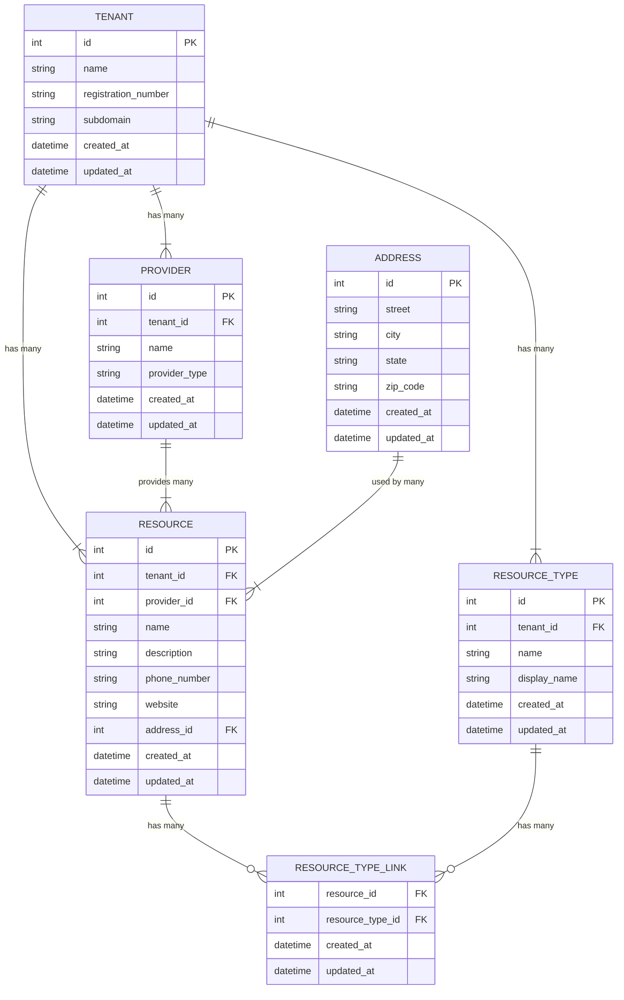

```mermaid
erDiagram
    TENANT {
        int id PK
        string name
        string registration_number
        string subdomain
        datetime created_at
        datetime updated_at
    }

    PROVIDER {
        int id PK
        int tenant_id FK
        string name
        string provider_type
        datetime created_at
        datetime updated_at
    }

    RESOURCE_TYPE {
        int id PK
        int tenant_id FK
        string name
        string display_name
        datetime created_at
        datetime updated_at
    }

    RESOURCE {
        int id PK
        int tenant_id FK
        int provider_id FK
        string name
        string description
        string phone_number
        string website
        int address_id FK
        datetime created_at
        datetime updated_at
    }

    ADDRESS {
        int id PK
        string street
        string city
        string state
        string zip_code
        datetime created_at
        datetime updated_at
    }

    RESOURCE_TYPE_LINK {
        int resource_id FK
        int resource_type_id FK
        datetime created_at
        datetime updated_at
        %% Composite primary key on (resource_id, resource_type_id)
    }

    TENANT ||--|{ PROVIDER : "has many"
    TENANT ||--|{ RESOURCE_TYPE : "has many"
    TENANT ||--|{ RESOURCE : "has many"

    PROVIDER ||--|{ RESOURCE : "provides many"

    ADDRESS ||--|{ RESOURCE : "used by many"

    RESOURCE ||--o{ RESOURCE_TYPE_LINK : "has many"
    RESOURCE_TYPE ||--o{ RESOURCE_TYPE_LINK : "has many"


```